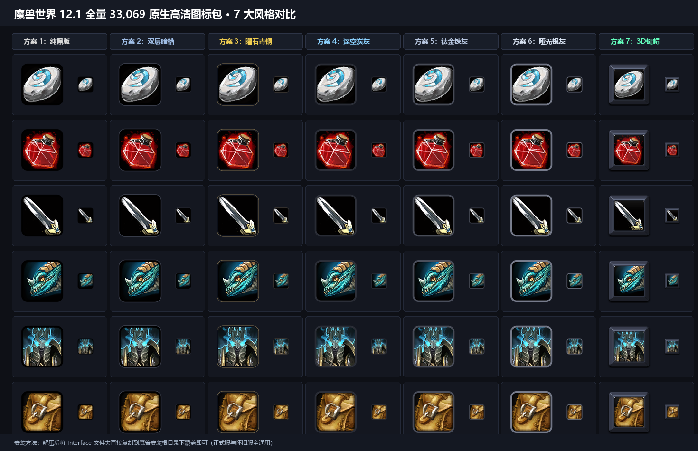

# ⚔️ World of Warcraft 12.1 Full 33,069 HD Icons AI Remaster
### 魔兽世界 12.1 全量 33,069 原生高清 AI 超分重构图标包体系

---

  <b>Language Navigation / 语言切换：</b> 
  <a href="#-简体中文"><b>🇨🇳 简体中文 (Main)</b></a> &nbsp;|&nbsp; 
  <a href="#-english"><b>🌐 English (Secondary)</b></a>

---

# 🇨🇳 简体中文

> 基于 **Waifu2x-CUnet（点阵融化去噪）＋ 4x_foolhardy_Remacri（艺术材质超分）** 级联神经网络，对魔兽当前全量 **33,069** 个图标进行 128px 原生 DXT5 BLP2 格式完全重构。
> **100% 全局全系统覆盖**（动作条、法术书、背包物品、装备栏、天赋树、大秘境地下城手册、成就、坐骑、宠物、WA 提示等），0 内存占用，永不报错！

## 🖼️ 7 大风格纯视觉矩阵一览

---

## 🎨 7 大全量方案特性索引

| 方案编号 | 风格方案名称 | 核心视觉工艺与特征 | 适用游戏场景与审美 |
| :---: | :--- | :--- | :--- |
| **方案 1** | **实心纯黑版** | 5.5px 纯黑高对比外框 ＋ 21px 经典圆角 | 极致黑白对比度，原画主体最醒目突出 |
| **方案 2** | **双层内嵌暗槽版** | 2.0px 炭灰外圈 ＋ 3.5px 纯黑下沉凹槽 | 暗黑地牢风格，双层深凹立体下陷感 |
| **方案 3** | **曜石暗青铜微丝版** | 纯黑曜石底框 ＋ 1.2px 暗哑古青铜微丝 | 魔兽原汁原味史诗奇幻感，金色传奇微光 |
| **方案 4** | **深空炭灰大师版** | 5.0px #2a2d36 极简暗调深炭灰 | 极度耐看、低调柔和不抢戏、与原生 UI 完美契合 |
| **方案 5** | **暴雪钛金铁灰版** | 5.0px #484c58 暴雪经典冷铁金属灰 | 工业硬派金属质感，经典耐看 |
| **方案 6** | **磨砂哑光银灰版** | 5.0px #737887 醒目中浅哑光银灰 | 战斗中按键边界轮廓最清晰 |
| **方案 7** | **3D 机械键帽版** | $R=8\text{px}$ 方形微导角 ＋ 宽斜坡四棱台 ＋ 剥离白边深炭灰修边 | 客制化 PBT 实体机械键盘敲击质感，3D 浮空立体感封顶 |

---

## 🚀 快速安装指南

1. **完全退出** 魔兽世界游戏客户端；
2. 在 [Releases 页面](https://github.com/tzdy1993/wow-hd-icons-remaster/releases) 下载你心仪风格的独立压缩包；
3. 将解压出来的 **Interface** 文件夹直接复制到你的魔兽安装根目录下覆盖：
   - **正式服路径**：World of Warcraft\_retail_\
   - **怀旧服路径**：World of Warcraft\_classic_\
4. 重新启动游戏即可生效！

### 🗑️ 卸载与还原
直接删除魔兽目录下的 Interface\ICONS 文件夹即可瞬间恢复暴雪默认图标，安全无残留。

---

## ⚡ 1 秒极速换装脚本

如果你在本地下载了多套方案，可以使用内置的切换脚本：

`ash
# 切换至 方案 4（深空炭灰大师版）
python switch_full_pack.py 4

# 切换至 方案 7（3D 机械键帽版）
python switch_full_pack.py b2

# 切换至 方案 5（暴雪钛金铁灰）
python switch_full_pack.py 5
`

---

# 🌐 English

> An end-to-end AI Super-Resolution remaster system for all **33,069** icons in World of Warcraft 12.1.
> Powered by **Waifu2x-CUnet (artifact melting) + 4x_foolhardy_Remacri (neural texture reconstruction)** in native 128x128 DXT5 BLP2 format with full 8-level Mipmaps.
> **100% full-game coverage** (Action bars, Spellbook, Bags, Talents, Adventure Guide, Mounts, Macros, WeakAuras). Zero Lua memory, zero FPS impact, zero errors!

## 🎨 7 Distinct Style Variants

| Scheme | Style Name | Visual Craft & Geometry | Best For |
| :---: | :--- | :--- | :--- |
| **Scheme 1** | **Solid Black** | 5.5px Solid Black Border + 21px Classic Radius | High contrast, maximum artwork pop |
| **Scheme 2** | **Dual Inner Groove** | 2.0px Charcoal Outer + 3.5px Pure Black Groove | Dark dungeon style, sunken 3D depth |
| **Scheme 3** | **Obsidian Bronze** | Obsidian Base + 1.2px Ancient Bronze Filigree | Classic Warcraft high-fantasy epic mood |
| **Scheme 4** | **Charcoal Grey** | 5.0px #2a2d36 Minimalist Deep Charcoal | Highly ergonomic, subtle, perfect with default UI |
| **Scheme 5** | **Titanium Grey** | 5.0px #484c58 Blizzard Cold Iron Grey | Industrial metallic hardness, crisp & solid |
| **Scheme 6** | **Matte Silver** | 5.0px #737887 Light Matte Silver Grey | Ultra-clear button outlines during intense raids |
| **Scheme 7** | **3D Keycap Master** | =8\text{px}$ Square Bevel + PBT Convex Keycap | Custom mechanical keyboard physical keycap feel |

## 🚀 Installation

1. Exit the World of Warcraft client completely;
2. Download your preferred scheme .zip from the [Releases](https://github.com/tzdy1993/wow-hd-icons-remaster/releases) page;
3. Extract and copy the **Interface** folder directly into your WoW root directory:
   - **Retail Path**: World of Warcraft\_retail_\
   - **Classic Path**: World of Warcraft\_classic_\
4. Launch the game and enjoy!

### 🗑️ Uninstallation
Simply delete the Interface\ICONS folder from your WoW directory.

---

## 🔬 Technical Architecture

`mermaid
graph TD
    A[Raw 64x64 CleanIcons 33,069 Icons] --> B[Waifu2x-CUnet Denoise 3 Dissolve 2004 Dithering]
    B --> C[4x_foolhardy_Remacri DirectML GPU 512x512 Upscaling]
    C --> D[Edge Trimming: Strip 4.5% Blizzard Bleed]
    D --> E[Multi-scheme 3D Lighting & Geometry Baking]
    E --> F[Lanczos 128x128 Sub-pixel Anti-Aliasing]
    F --> G[DirectX Texconv Hardware BC3_UNORM Compression]
    G --> H[Native BLP2 Packaging with 8 Mipmap Levels]
    H --> I[WoW Client Interface/ICONS 100% In-Game Coverage]
`

---

## 📄 License

Code is licensed under the [MIT License](LICENSE). All World of Warcraft game assets and intellectual property belong to Blizzard Entertainment.
